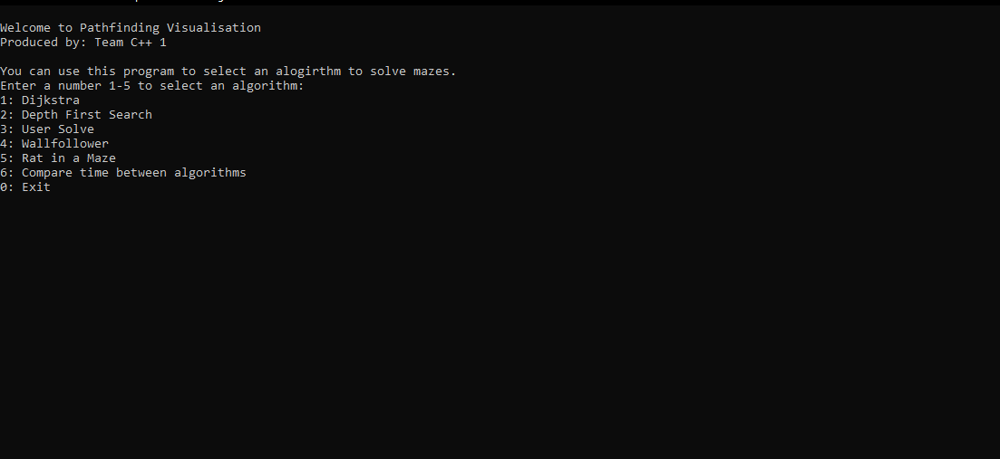
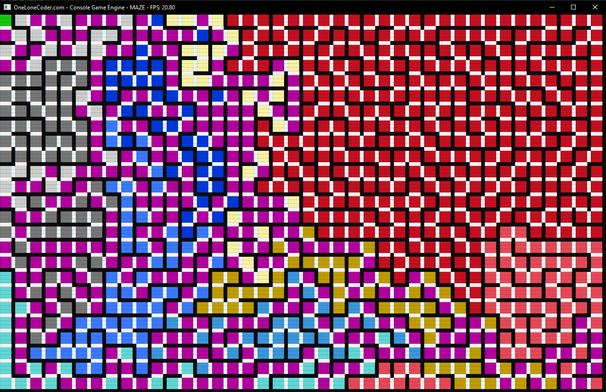

# Path Finding Visualization

# Description:
This is a project that uses the olcConsoleGameEngine to generate a Maze and then solve the maze with the users preferred algorithm.

# Build:
To build this project, please download all necessary files and run them in a Visual Studio Project. Must be on Windows since the game engine uses the windows.h library

# How it looks:
This is the main menu:

This is the solution from Dijkstra's algorthim in purple:

